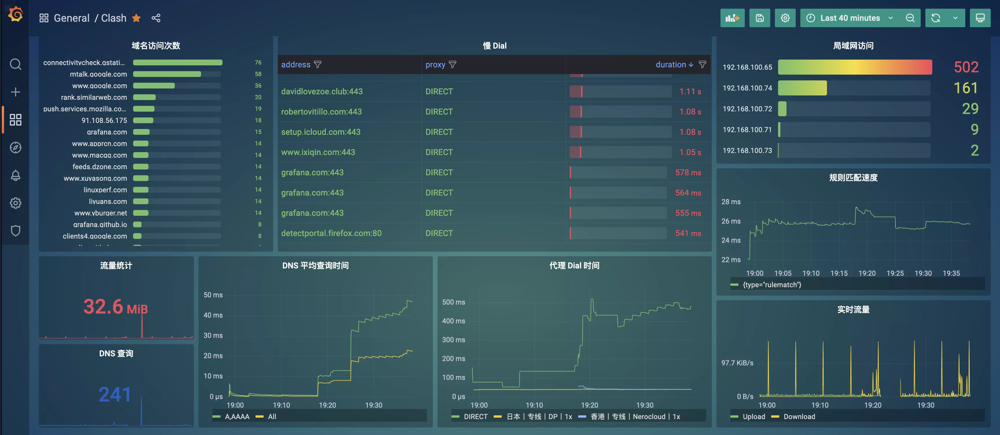

# Clash Tracing Dashboard

An example of a clash tracing exporter API.

### Screenshot

### How to use

1. `kubectl create ns monitoring`
2. modify deployment.yaml(change environment) and apply: `kubectl apply -f deployment.yaml`
3. `kubectl apply -f vector`
4. `kubectl apply -f loki`
5. setup Grafana (add datasource named loki)
6. `bash hack.sh`
7. import `panels/dashboard.json` and `panels/logs.json` to Grafana
